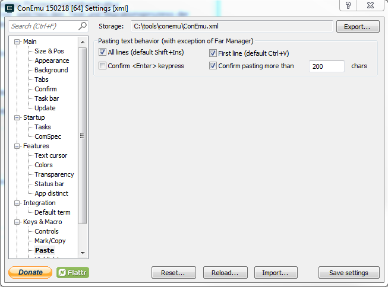

 	
 	cd 
## Installation 
* Install [Sublime Text 3](http://www.sublimetext.com/3)
* Install [Package Control](https://packagecontrol.io/installation)
* Install this Plugin from Sublime with `CTrl-Shift-P / Package Control: Install Package / ExternalREPL`

### windows
Installation:
* Add Sublime Directory to Path. This adds the `subl` command.
* Adjust ConEmu Settings
	* deactivate `Keys & Macro/Paste/Confirm <Enter> keypress`

Plugin send command to Konsole with  'ConEmuC -GuiMacro:0 Paste(0,"command\\n")'

Start a new session:
Start sublime from ConEmu with `subl`. This makes sure that ConEmuC is on path 

### Linux
* Installation 
Install [Tmux](https://tmux.github.io/) for Mac / Linux 
Plugin interacts with session `repl` via `tmux send-keys -t repl "commmand"`

* Usage
Start session with `tmux new s repl`.
From Tmux you can detach with `Prefix(C-b) d`.
and reattach to your tmux session with `tmux a -t repl`

## Usage
It is recommended to start sublime from your console using the `subl` command.
`Command()-Shift P` and typing `External` shows the commands. 
Hotkeys are shown via `F1`

### repl Commands
`cs-ENTER`    Sending selected text (or current line) and <Enter> to the repl
`c-up`        Sending up arrow and Enter to the repl. This hopefully executes your last command. last repl command (doesn't work in pry on windows)  

### Editor Commands
Those Commands runs or loads the current file or executes test in the language of its syntax.
It is possible to execute only the selected test. 
There is a convention for naming of testfiles. This makes it possible to switch between implementation and tests.
The commands are run from the root of the sublime folder, so your project directory needs to be in the sublime side bar.

|  Language  | comment |      run      |     load    | test framework |      test     |            test_one           |     testfile     |
|------------|---------|---------------|-------------|----------------|---------------|-------------------------------|------------------|
| powershell | #       | <file>        | . <file>    | psspec         | psspec <file> | psspec <file> -example <name> | <file>.tests.ps1 |
| ruby       | #       | load '<file>' | ruby <file> | minitest       |               |                               |                  |
| fsharp     | //      |               |             |                |               |                               |                  |
| clojure    | ;       |               |             |                |               |                               |                  |
| dot        |         | dot           |             |                |               |                               |                  |
| markdown   |         | pandoc -> doc |             |                |               |                               |                  |

`cs-.` load file  
`F5`   run file   
`cs-t` run testfile             
`cs-o` excecute selected test   
`cs-'`      switch code<->test  
`cs-s` Execute last editor Command
`sc-h` Execute from history
`cs-c` change directory/ns 

### Miscellaneous Commands
This is a grabbag for some stuff that i found useful at a time.
`cs-1` open explorer
`cs-2` dublicate file (This is quite useful)
`cs-3` open file on selected editor line (http:// in chrome or with sublime )
`f1`   show shortkeys
`cs-4` restructure mdTOC                                                                             

## Troubleshooting

### Silent Failure
## Check if console is in your path
Open the sublime console  `c-`` 

    import os
    os.environ['PATH'] = "/usr/local/bin:" + os.environ['PATH']

Check if `tmux` or `ConEmuC` is on your path. If not consider starting sublime from the console using the `subl` command.

## License    
MIT-License (see license.txt)
